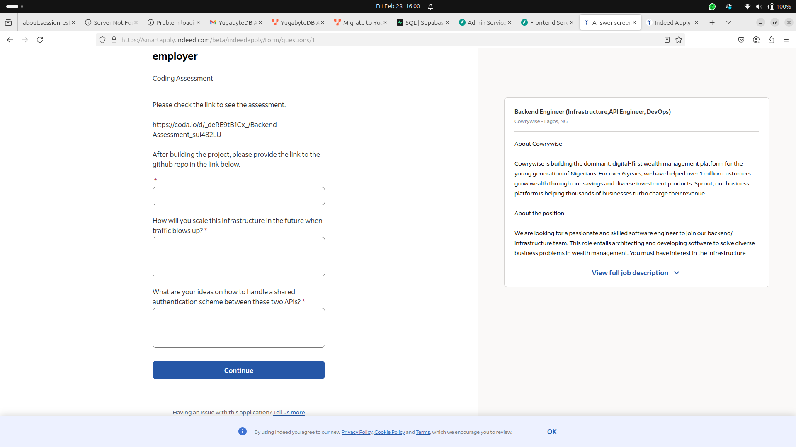

Below is a **comprehensive** response covering each of the questions mentioned [here](https://smartapply.indeed.com/beta/indeedapply/form/questions/1) but look at the scrrenshot below:



1. **Using the same database** for both services, I asked this question myself 
2. **Scaling** the infrastructure in the future,  
3. **Handling a shared authentication scheme**, and  
4. **Why we used direct HTTP calls instead of a **message broker** (e.g., RabbitMQ) for service-to-service communication**.

---

## 1. Can We Use the Same Database?

### The Short Answer
- **Yes**, technically we *can* use the same physical database (the same host and DB instance) for both the **Admin** and **Frontend** services if you want to. In that case, we might separate them by **schemas** or **table name prefixes**.  

### But the Requirement of Assessment Said “Different Data Stores”
The original instructions specified:  
> “The two services should use different data stores.”

That requirement suggests that each service manages its own data entirely (e.g., separate databases or separate DB instances). I believe that the **reason** behind that design principle is **loose coupling** explained below briefly:

- **Independent Failure:** If one DB goes down, it doesn’t necessarily take the other service down.  
- **Independent Scaling**: Each service can tune or scale its database to meet its own needs.  
- **Service Boundaries**: The Admin service “owns” the book catalog from an admin perspective, the Frontend service “owns” user enrollment and book-borrow state.  

If we combine them into one database, we lose *some* of those benefits. However, for a smaller project or proof-of-concept, using a single database can be simpler.

---

## 2. How to Scale When Traffic Blows Up

When you start getting **high traffic**, consider:

1. **Container Orchestration**  
   - Use **Kubernetes** or **Docker Swarm** to run multiple replicas of each service.  
   - A **load balancer** (like an NGINX Ingress or AWS ALB) distributes incoming requests among these replicas.

2. **Stateless Services**  
   - Keep both the **Frontend** and **Admin** services as stateless as possible (no sticky sessions, no local file-based sessions).  
   - This ensures you can scale horizontally by simply adding more service replicas.

3. **Database Scaling**  
   - If your database is cloud-hosted (like **Supabase** or **RDS** or **CLICKHOUSE** or **YUGABYTE**), you can leverage read replicas and vertical scaling.  
   - For **Yugabyte** or **PostgreSQL** clusters, you can scale horizontally or regionally (especially with Yugabyte’s distributed architecture). see more info [here](https://www.yugabyte.com/blog/understanding-how-yugabyte-db-runs-on-kubernetes/)

4. **Caching**  
   - Use an in-memory cache (like **Redis**) to reduce load on the DB for frequent reads.  
   - Might also set up a CDN  or fast cache for static content and frequently accessed queries.

5. **Monitoring & Observability**  
   - Tools like **Prometheus/Grafana** or **Datadog** to track performance and spot bottlenecks early.

**High-level**: You’d follow typical microservices scaling patterns—each service can be **horizontally scaled** behind a load balancer, with **resilient** data store solutions, caching, and possibly **CQRS** or more advanced patterns if the domain grows complex.

---

## 3. Ideas for Shared Authentication Between the Two APIs

Since the original requirements said “The endpoints need not be authenticated,” we didn’t implement auth. But in a real scenario, we might do:

1. **Token-Based Auth (JWT)**  
   - Users log in (or get a token from a **Auth** service).  
   - The **Frontend** and **Admin** endpoints require a **JWT** in the `Authorization` header.  
   - The admin might have a “role: admin” claim in the token, so the Admin service checks for that claim.  
   - The user might have “role: user” for the borrowing endpoints on the Frontend side.

2. **API Key or Basic Auth**  
   - If it’s a simpler use-case or an internal system, each service might require an **API Key** in headers.  
   - This is less secure than a robust token-based system, but can be sufficient for internal microservices calls.

3. **SSO / OAuth / OIDC**  
   - If you want to unify the user’s identity across multiple microservices, you might integrate with an **OAuth 2.0** or **OpenID Connect** provider.  
   - The user logs in via that provider, obtains tokens, and both services accept those tokens.

### Shared Auth Flow
- Typically, you have **one** identity provider or a separate **Auth** microservice that handles user registration/login.  
- Both our **Frontend** and **Admin** services call that provider to validate tokens or retrieve user roles.  
- This ensures a consistent identity system across all microservices.

---

## 4. Why Not Use RabbitMQ (Message Broker) for Sync?

I noticed that the Admin service **directly** calls `requests.post()` / `requests.delete()` to the Frontend. Why not a **message broker** like RabbitMQ or Kafka?

### Direct HTTP Pros
- **Simplicity**: A direct HTTP call is easy to implement and reason about.  
- **Immediate**: The Admin knows whether the notification succeeded or failed instantly (via HTTP status code).  
- **Lightweight**: For small-scale systems, it’s often enough.

### Message Broker Pros
1. **Async & Decoupled**  
   - The Admin service **publishes** a “BookCreated” message. The Frontend receives it asynchronously. The Admin doesn’t need to know the Frontend’s address or handle immediate success/failure from the Frontend.  
2. **Scalability**  
   - For large, high-throughput systems, a message queue can handle spikes better.  
3. **Retry / Durable**  
   - Message brokers often have built-in retry mechanisms or guaranteed delivery. If the Frontend is temporarily down, the message is queued until it’s back up.

### Why Didn’t I Use It Here in this Assessment?
- The original Test project was a **relatively small** sample.  
- Setting up RabbitMQ or Kafka adds complexity (an extra service, connection details, etc.).  
- The requirement didn’t specifically mention async or eventual consistency. A synchronous “Admin calls Frontend” approach was enough.

**In a real production environment** with bigger scale and a microservices architecture, you might prefer a **message-based** approach for the advantages above (decoupling, reliability, eventual consistency). But for a simpler MVP or a small system, **direct HTTP** calls suffice.

---


## 5. Run The Application?

- **kindly**: view the screenshots in the screenshot folder  of the Task project operation . to test this application, in the root directory , 

run

```
docker compose up --build -d
```

to get this confirmation of the frontend and admin service running below
```
✔ Network managebook_default            Created                                                                                                              0.1s 
✔ Container admin_service_container     Started                                                                                                              0.4s 
✔ Container frontend_service_container  Started  
```

To shutdown the application,  run

```
docker compose down
```

to obtain output similar to the information below

```
WARN[0000] /home/adesoji/managebook/docker-compose.yml: the attribute `version` is obsolete, it will be ignored, please remove it to avoid potential confusion 
[+] Running 3/3
 ✔ Container admin_service_container     Removed                                                                                                              0.0s 
 ✔ Container frontend_service_container  Removed                                                                                                              0.8s 
 ✔ Network managebook_default            Removed 
```
---
## My Final Thought Snippets 

- **Using the Same Database**: Feasible but breaks the “different data stores” design principle. Not recommended for fully decoupled microservices.  
- **Scaling**: Docker/Kubernetes + load balancing, caching, and a scalable database is the typical path.  
- **Shared Auth**: Typically done via **JWT** or OAuth 2.0-based solutions.  
- **Why Not RabbitMQ**: HTTP calls are simpler for small systems. A message broker is more robust, but also more overhead. If you anticipate bigger scale or complex workflows, a **message broker** or **event-driven** approach is definitely worth considering.